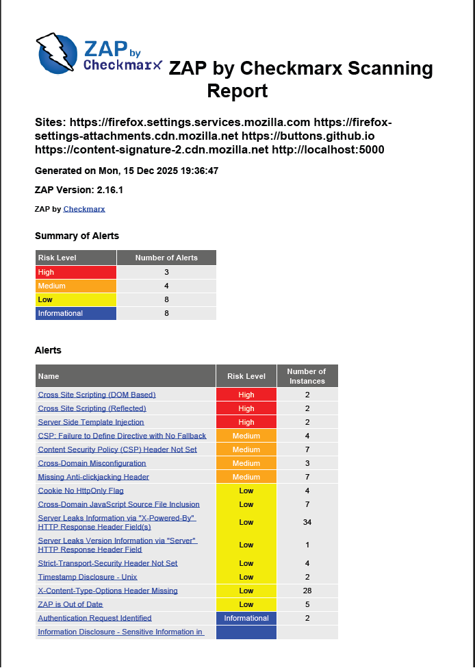
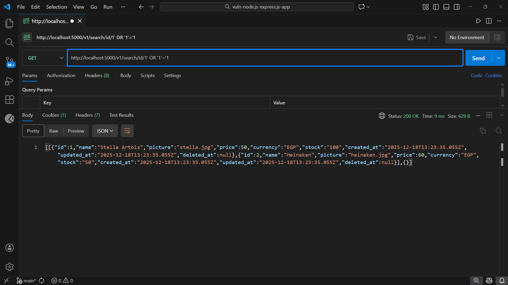
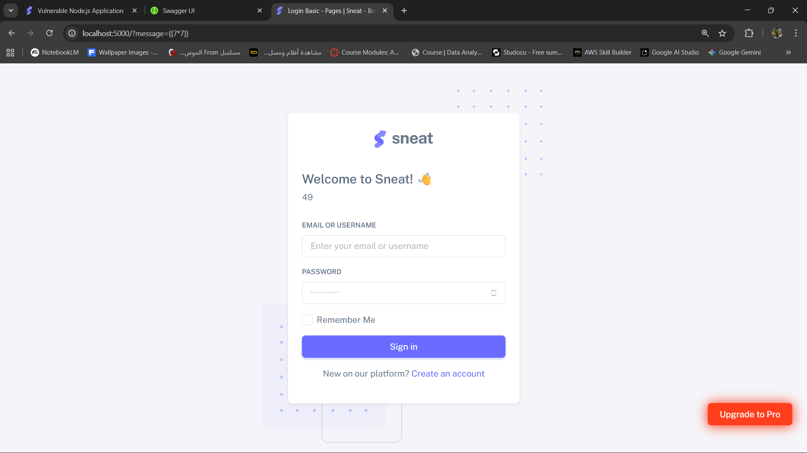
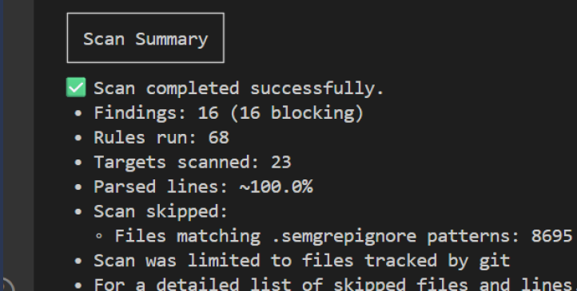
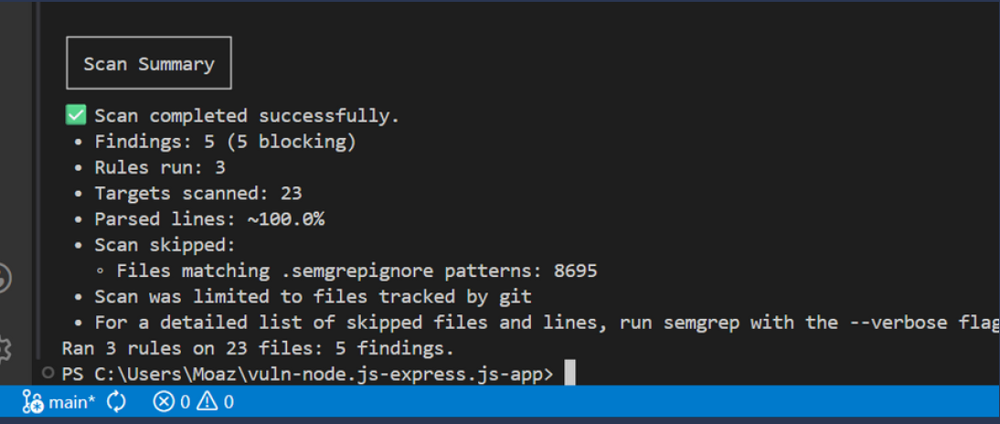
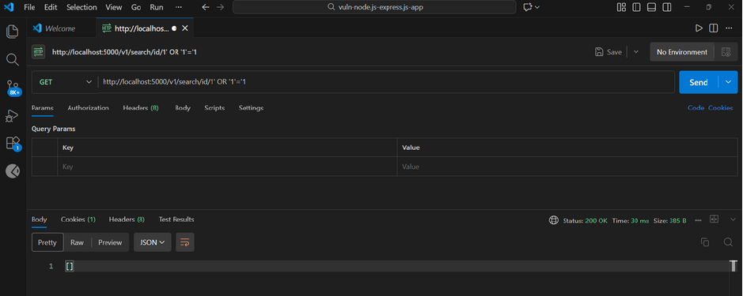
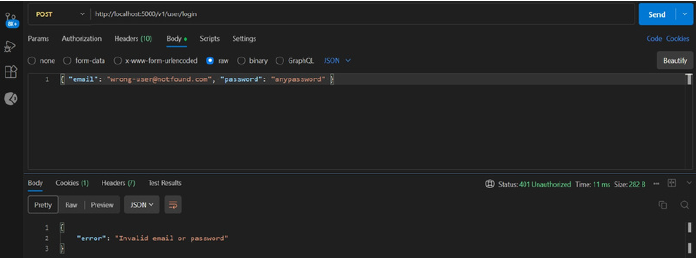
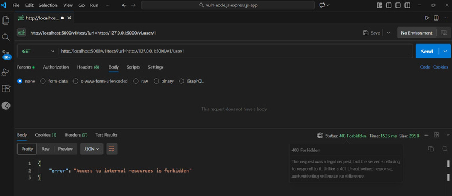
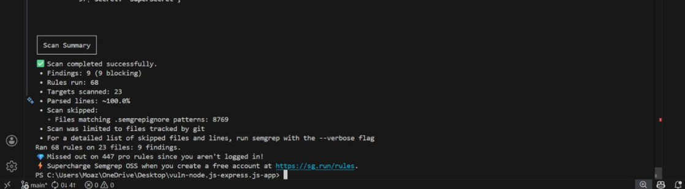
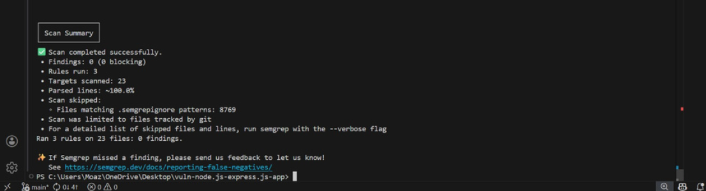

# 🛡️ Full Security Lifecycle Audit & Remediation Report
## Project: Vulnerable Node.js & Express Application
**Organization:** Alexandria National University - Faculty of Engineering

---

## 👥 1. Development & Security Team
* [cite_start]**Moaz Ahmed** - ID: 2305040 [cite: 7]
* [cite_start]**Mosab Magdy** - ID: 2305069 [cite: 8]
* [cite_start]**Abdelrhman Soliman** - ID: 2305030 [cite: 9]

**Presented to:** Eng. [cite_start]Mohamed Hatem Abdulkader [cite: 11]

---

## 📖 2. Executive Summary
[cite_start]This comprehensive repository documents the end-to-end security hardening of a Node.js web application[cite: 5, 13]. [cite_start]We transitioned the application from a highly vulnerable state (16 major findings) to a production-ready secured state (0 custom rule findings)[cite: 291, 507]. [cite_start]Our approach combined automated DAST, manual exploitation, and SAST-driven remediation[cite: 16, 505]. The project follows the OWASP Top 10 guidelines to ensure all critical attack vectors are addressed.

---

## 🔍 3. Section 1 - DAST Findings (Identification Phase)
[cite_start]The Dynamic Application Security Testing (DAST) was performed using a two-phased hybrid approach to ensure maximum coverage[cite: 16].

### 3.1 Automated Scanning Overview (OWASP ZAP)
[cite_start]We used **OWASP ZAP 2.16.1** to establish a baseline of the security posture[cite: 17, 28].
* [cite_start]**High-Risk Alerts:** 3 critical vulnerabilities identified including XSS and SSTI[cite: 53, 54].
* [cite_start]**Medium-Risk Alerts:** 4 vulnerabilities related to security configurations and headers[cite: 55].
* [cite_start]**Low & Informational Alerts:** 16 findings providing insights into information leakage[cite: 56].


[cite_start]*Figure 1: OWASP ZAP Executive Summary[cite: 50].*

### 3.2 Manual Penetration Testing Results
[cite_start]Using **Postman**, we manually verified 8 critical vulnerabilities (V1 to V8) identified during the reconnaissance phase[cite: 19, 63].

| ID | Endpoint | Vulnerability | OWASP Category | Short Impact |
| :--- | :--- | :--- | :--- | :--- |
| **V1** | `/v1/search/id/` | SQL Injection | A03: Injection | [cite_start]Critical: Mass data leakage [cite: 63] |
| **V2** | `/?message=` | Reflected XSS | A03: Injection | [cite_start]High: Client-side script execution [cite: 63] |
| **V3** | `/?message=` | SSTI | A03: Injection | [cite_start]Critical: Remote Code Execution [cite: 63] |
| **V4** | `/v1/user/login` | User Enumeration | A01: Broken Access Control | [cite_start]Medium: Account status discovery [cite: 63] |
| **V5** | `/v1/user/token` | JWT Manipulation | A02: Crypto Failures | [cite_start]High: Privilege Escalation [cite: 63] |
| **V6** | `/v1/user/:id` | IDOR (BOLA) | A01: Broken Access Control | [cite_start]High: Unauthorized access [cite: 63] |
| **V7** | `/v1/test/?url=` | SSRF | A10: SSRF | [cite_start]High: Internal network exposure [cite: 63] |
| **V8** | `/v1/user/` | Identification Failure | A07: Auth Failures | [cite_start]Medium: Weak password acceptance [cite: 63] |

---

## 🧪 4. Detailed Exploitation Proofs (POCs)

### 4.1 SQL Injection (V1)
* [cite_start]**Exploit:** Appending the malicious payload `1' OR '1'='1` to the ID parameter[cite: 101].
* [cite_start]**Result:** The database evaluated the statement as true for every row, bypassing intended filters[cite: 102].
* [cite_start]**Observation:** The server leaked all product records including Stella Artois and Heineken[cite: 103].


[cite_start]*Figure 2: Mass data disclosure via SQL Injection[cite: 66, 103].*

### 4.2 SSTI & XSS (V2 & V3)
* [cite_start]**SSTI Proof:** Submitting `{{7*7}}` in the message field; the server returned `49`[cite: 123].
* [cite_start]**XSS Proof:** Injected `<script>alert('XSS')</script>` which executed directly in the browser[cite: 116].


[cite_start]*Figure 3: Server-Side Template Injection results[cite: 117, 123].*

---

## 🤖 5. Section 2 - Semgrep (SAST) Findings
[cite_start]We utilized Semgrep to map DAST findings directly to the source code for targeted patching[cite: 287].

### 5.1 Initial Scan Summary
* [cite_start]**Total Findings:** 16 Critical Findings[cite: 291, 300].


[cite_start]*Figure 4: Initial SAST scan results with 16 findings[cite: 289].*

### 5.2 Custom Rules Evidence
[cite_start]We authored custom rules to demonstrate advanced detection[cite: 312, 329].


[cite_start]*Figure 5: Custom Semgrep rules identifying project vulnerabilities[cite: 330].*

---

## 🛠️ 6. Section 3 - Remediation (The Fixes)
[cite_start]We implemented enterprise-grade code changes to mitigate all identified risks.

| Vulnerability | Remediation Strategy | Security Impact |
| :--- | :--- | :--- |
| **SQLi** | Parameterized Queries via Sequelize ORM | [cite_start]Prevents malicious SQL execution  |
| **XSS/SSTI** | Secure `res.render` with data binding | [cite_start]Inputs treated as literal text  |
| **IDOR** | `req.userId` vs `req.params.id` check | [cite_start]Ensures users only access own data  |
| **SSRF** | IP Blacklisting for internal ranges | [cite_start]Prevents proxy attacks on internal infra  |
| **Weak Password**| Bcrypt Hashing & 8-char policy | [cite_start]Protects credentials even if leaked  |

---

## ✅ 7. Section 4 - Re-test Evidence (Verification)
[cite_start]Post-remediation tests confirm that the application is now secure and exploits fail[cite: 337, 469].

### 7.1 Manual Verification (After Fixes)
1. [cite_start]**SQLi Fixed:** The payload `1' OR '1'='1` now returns an empty array `[]`[cite: 365].
   

2. [cite_start]**User Enumeration Fixed:** Unified error `Invalid email or password` for all attempts[cite: 374].
   

3. [cite_start]**SSRF Fixed:** Requests to `127.0.0.1` blocked with `403 Forbidden`[cite: 427].
   

### 7.2 Automated Verification (Final Semgrep)
* [cite_start]**Standard Rules:** Total findings dropped from 16 to **9 informational audit items**[cite: 486].
* [cite_start]**Custom Rules:** **0 Findings** across all 23 files[cite: 507, 508].


[cite_start]*Figure 6: Semgrep scan after standard remediation[cite: 472].*


[cite_start]*Figure 7: Final SAST validation confirming clean codebase for custom rules[cite: 490, 508].*

---

## 🚀 8. Installation and Running Instructions

### 1. Prerequisites
- Node.js (v14+)
- SQLite/MySQL

### 2. Setup
```bash
# Install project dependencies
npm install
### 3. Security Scanning
To verify the remediation, execute the following security scans:

```bash
# Run baseline scan using standard community rules
semgrep --config auto .

# Run custom ruleset verification for project-specific vulnerabilities
semgrep --config semgrep-rules/ .
